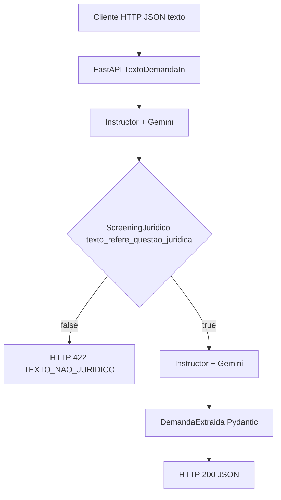

# Arquitetura — Parser Jurídico (Ex. 5)

## Contexto

Serviço **FastAPI** que expõe um único endpoint operacional de negócio (`POST /analisar`) para transformar **texto livre** em **JSON estruturado** validado, adequado a triagem em escritório (simulado).

## Componentes

| Camada | Responsabilidade |
|--------|-------------------|
| **`app/main.py`** | Rotas HTTP, erros (`422` / `503`), contrato OpenAPI |
| **`app/schemas/demanda.py`** | Modelos Pydantic — entrada, screening e saída |
| **`app/services/parser_juridico.py`** | Orquestração LLM via **Instructor** (duas chamadas Gemini) |

## Fluxo de dados

## Decisões

1. **Duas chamadas ao modelo** — separar **classificação** (gate) de **extração** reduz alucinações de campos quando o input é claramente não jurídico.  
2. **Instructor em vez de Guardrails** — mesmo ecossistema **Google GenAI** já usado no curso; o enunciado permite alternativa.  
3. **Sem persistência** — foco em parsing síncrono; filas ou BD podem ser camadas seguintes.

## Docker

Imagem `python:3.11-slim`, porta **8000**, código montado em volume para desenvolvimento (`.:/app`).
